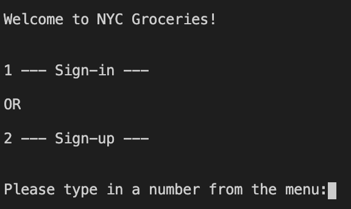
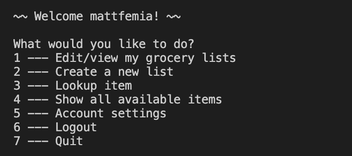
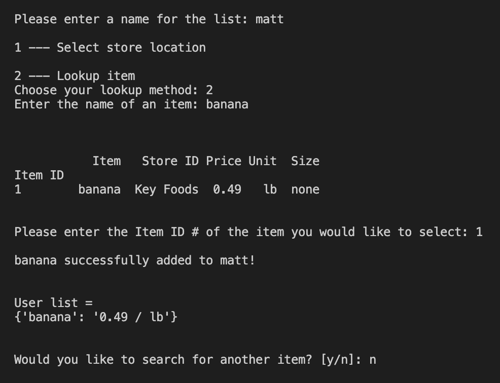

# NYC GROCERY APP

#### NYC-based application with a few primary goals (to start):

1. Allow users to see where an item is currently stocked in NYC
2. Provide users with the lowest price options for items in their grocery lists
3. Increase visibility of smaller vendors/bodegas in NYC

---

## Welcome Menu

## Main Menu

## Account 

## Grocery Lists

  
---

#### Tentative project Outline:

- [x] CLI interface text application
  - [x] Database design
  - [x] Basic Functionality (Account creation, database queries, program navigation)
  - [ ] Refactor
  - [x] Restructure database based on any new features
  - [ ] Write tests [ retrospectively ]
  - [ ] Populate database (web scraper, APIs, manually)
  - [ ] Polish + test functionality with .exe file
- [ ] Temporary GUI --> Flask web app or JS-based interface
- [ ] Mobile application
  - [ ] iOS
  - [ ] Android
